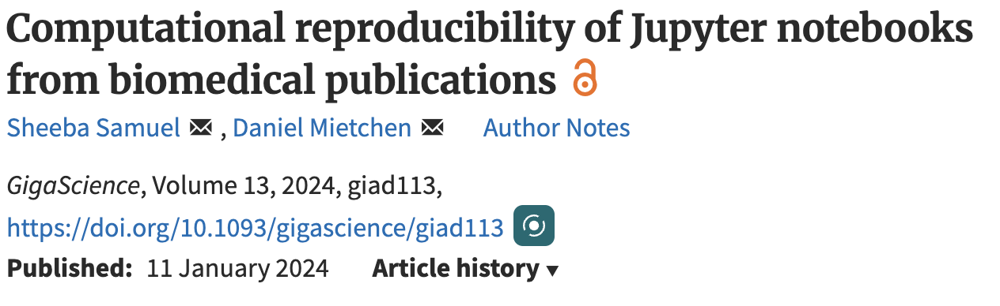
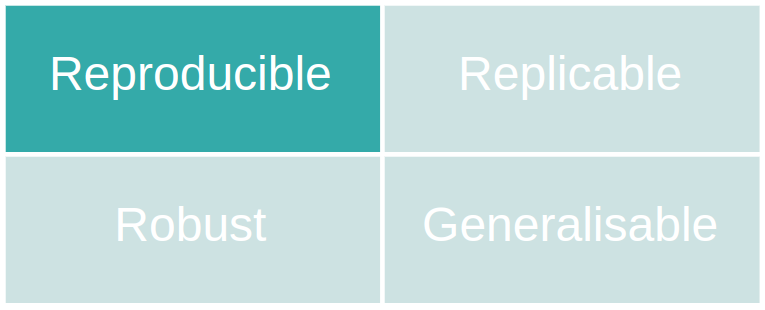
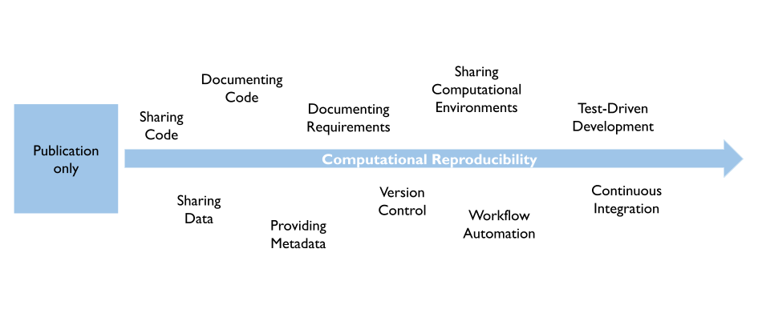
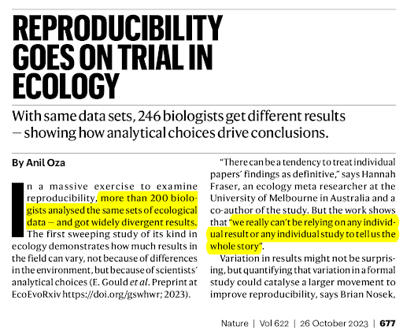
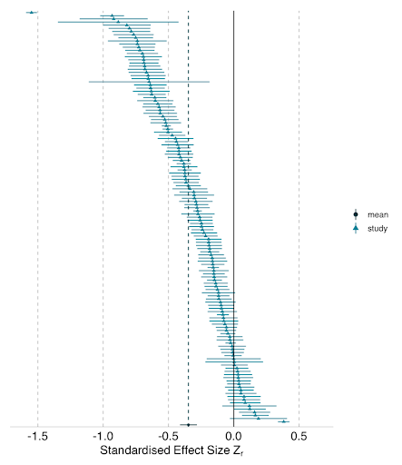

## Computational reproducibility

A (too) simple definition:

[The **same analysis**]{.fragment} [of the **same data**]{.fragment} [produces the **same results**]{.fragment}

\

::: fragment
{fig-align="center" width="50%"}
:::
------------------------------------------------------------------------

## Example 1

{fig-align="center" width="70%"}

::: incremental
-   Attempted to rerun **22,578 Jupyter notebooks** from 3,467 PubMed publications
-   For 10,388 of these, all declared dependencies could be installed successfully
-   1,203 notebooks ran through without any errors
-   **879 notebooks (4%)** produced results identical to those reported in the original
:::

------------------------------------------------------------------------

## Example 2

{fig-align="center" width="70%"}

::: incremental
-   Attempted to rerun **9,000 R files** associated with 2,000 data sets in Harvard Dataverse
-   44% ran through without error when when code cleaning was applied
-   **26% ran through without error**
:::

::: fragment
$\rightarrow$ **Still optimistic estimates: Code from non-sharing authors likely less reproducible!**
:::

::: fragment
$\rightarrow$ **Computational reproducibility can be challenging in practice!**
:::

------------------------------------------------------------------------

## Context and terminology

 

{fig-align="center" width="75%"}

------------------------------------------------------------------------

## Computational reproducibility

{.absolute right="0" top="0" height="75"}

------------------------------------------------------------------------

## Replicability: Example

{.absolute right="0" top="0" height="75"}

{fig-align="center" width="640"}

------------------------------------------------------------------------

## Robustness: Example

{.absolute right="0" top="0" height="75"}

::::: {.columns align="center"}
::: {.column width="50%"}

:::

::: {.column width="50%"}
{height="400"}
:::
:::::

------------------------------------------------------------------------

## Generalizability

{.absolute right="0" top="0" height="75"}

 

{fig-align="center" width="50%"}

::: fragment
$\rightarrow$ **Reproducibility + Robustness + Replicability necessary for Generalizabilty!**
:::

------------------------------------------------------------------------

## Every step counts

:::::::::::: {.columns align="center"}
:::::: fragment
::::: {.columns align="center"}
::: {.column width="72%"}
Reproducible research may feel overwhelming.
:::

::: {.column width="28%"}

:::
:::::
::::::

::::::: fragment
:::::: {.columns align="center"}
:::: {.column width="60%"}
Do not despair! With every step...

::: incremental
-   you are already **one step ahead**
-   you **already improve** the quality of your research   (and of your life)
-   you learn **broadly applicable technical skills**
:::
::::

::: {.column width="40%"}
{fig-align="center" width="100%"}
:::
::::::
:::::::
::::::::::::

------------------------------------------------------------------------

## The Swiss Reproducibility Network Academy

::::: columns
::: {.column width="80%"}
-   **Early career** researchers section of the Swiss RN

-   Goal 1: Connect young researchers interested in **reproducibility in Switzerland**

-   Goal 2: Improve reproducibility of research in Switzerland

-   How to join?

    -   young researchers in **Switzerland** (working language: English)
    -   **interest** in improving research and reproducibility
    -   **every field** is welcome (diversity is the key!)

-   More information: <https://www.swissrn.org/contents/academy/>
:::

::: {.column width="20%"}

:::
:::::

------------------------------------------------------------------------

## The Center for Reproducible Science and Research Synthesis

::::: {.columns align="center"}
::: {.column width="50%"}
{height="250"}

<https://www.crs.uzh.ch>

:::

::: {.column width="50%" align="top"}
**Teaching and training**

-   Good Research Practice courses\
-   Educational resources, e.g., [Primers](https://www.crs.uzh.ch/en/resources/CRS-Primers.html)\
-   [ReproducibiliTea](https://www.crs.uzh.ch/en/training/ReproducibiliTea.html) journal club

**Research**

-   Evidence synthesis in biomedical research
-   Open research data
-   Methods for replication studies
-   Assessing and improving research  quality
:::
:::::

------------------------------------------------------------------------

## Structure of this workshop

1.  **Introduction** -- what is computational reproducibility?

2.  **Version control**

3.  **Dynamic reporting**

4.  **Workflow management**

5.  **Software containers**

3.  **Sharing and publishing** -- How to share it with others?

::: fragment
Website with all materials: <https://crsuzh.pages.uzh.ch/operra-reproducibility/>
:::

------------------------------------------------------------------------
